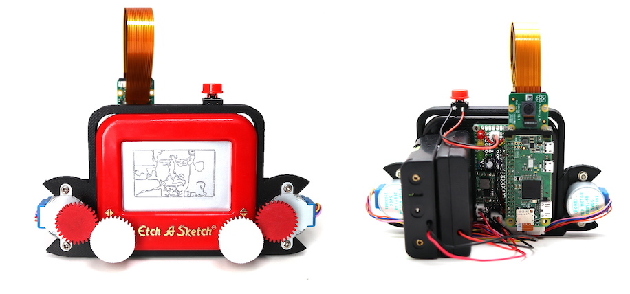

# Etch-A-Snap

**Etch-A-Snap** is (probably) the worlds first **Etch-A-Sketch Camera**. Powered by a Raspberry Pi Zero (or Zero W) it snaps photos just like any other camera, but outputs them by drawing to an *Pocket Etch-A-Sketch* screen. Quite slowly.

Photos are processed down to 100x60 pixel 1-bit (black & white) line drawings using `Pillow` and `OpenCV` and then translated into plotter commands by building a network graph representation with `networkx`. The *Etch-A-Sketch* wheels are driven by two 5V stepper motors mounted into a custom 3D printed frame. The *Etch-A-Snap* is entirely portable and powered by 4xAA batteries & 3x18650 LiPo cells.

The *developing time* for a photo is approximately 15-30 minutes depending on complexity. 

The first video below shows the process of taking a photo with the *Etch-A-Snap*, including the initial drawing of the image on the screen. The second clip is a timelapse showing the drawing of the resulting picture.

Keep scrolling for some more examples.

## Camera Examples

These shots were taken live using the Etch-A-Snap — a single shot was taken and immediately drawn to the screen. The drawing process was captured using a timelapse camera.

Outdoor street view showing the Etch-A-Snap struggling a bit on building details. 

## Image examples

The Etch-A-Snap can also draw a picture from any image type supported by `Pillow` using the `draw.py` utility. Using this script the Etch-A-Snap crops, resizes and processes the images the exact same way as from the camera, but you can be a bit more selective with the image and increase the chances of getting something half decent out.

*Etch-A-Sketch logo* generated from a monochrome PNG. 

**The Queen**. There is no route-optimisation (travelling salesman) at work when drawing, aside from adding weight to previously draw areas to encourage avoiding them in future. This picture of the Queen shows some serious back-tracking over the hair/top right corner.

**Django Wagner**. Het is weer weekend. This picture produces a poorly connected network around the face, which Etch-A-Snap deals with by adding a number of linker lines (shown in red). These links are optional additions, which can be used to shortcut while drawing but omitted if not needed — the right ear shows an example of an unused linker. 

## Requirements

The following is required to run Etch-A-Snap. You don't need `gpiozero` when running the processing code in the Jupyter Notebook.

    opencv-python==4.0.0.21
    Pillow==6.0.0
    numpy==1.16.2
    gpiozero==1.4.0

## More stuff

The following bits and bobs are also available — 

* You can [download the STL](http://download.mfitzp.com/etch-a-snap-3d-prints.zip) files for 3D printing, or edit the model on [TinkerCad](https://www.tinkercad.com/things/13uotDFY1AL-etch-a-snap) directly.
* The circuit [Fritzing file is also available](http://download.mfitzp.com/Etch-A-Snap.fzz).
